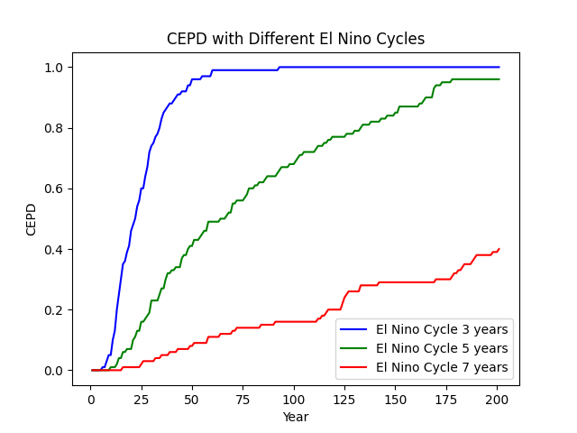

# Project 04 – Climate Event Pattern Dynamics (CEPD) and El Niño Simulation

## Overview
This project investigates how different **El Niño cycles** affect long-term climate event pattern dynamics (CEPD).  
Using synthetic simulation data, the project models El Niño cycles of **3, 5, and 7 years**, then visualizes how each influences cumulative event probability distributions across 200 years.

The work combines Python-based statistical computation, visualization, and modular analysis.  

---

## Objectives
- Model El Niño cycles with varying periodicities.  
- Calculate CEPD for each cycle.  
- Compare trends and visualize cumulative effects over time.  
- Analyze and extend results through structured experiment scripts.

---

## Files and Structure

```
.
├── CEPD_Plots.png
├── README.md
├── extension.py
├── extension2.py
├── lab04
│   ├── rand.py
│   └── random_numbers.png
└── penguin.py
```

## How to Run

1. **Open the CS_152-Computational-Thinking-Science folder **:
   ```bash
   cd project04
   ```
2 Run the main simulation:
```
python3 penguin.py
```
## Extensions:

python3 extension.py – performs deeper statistical analyses.

python3 extension2.py – explores long-term CEPD convergence patterns.

## Output


Interpretation

Blue (3 years) → Fastest saturation of CEPD, indicating frequent climate influence.

Green (5 years) → Moderate growth trend.

Red (7 years) → Slowest response, showing weaker periodic impact.


